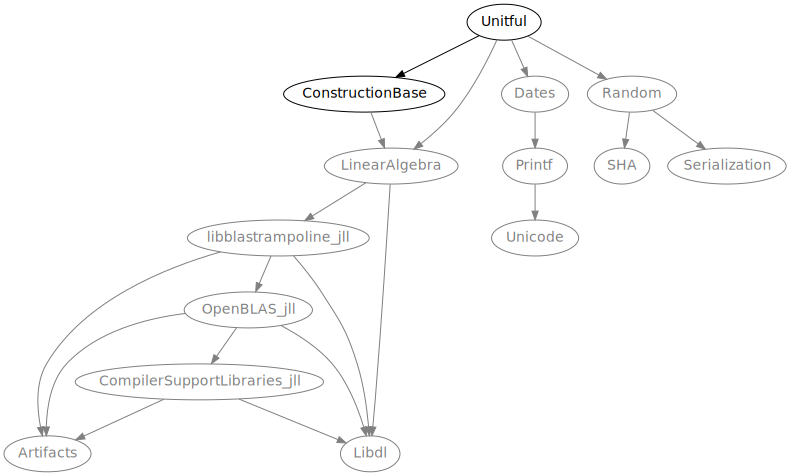

# PkgGraph.jl &nbsp;[![][latestimg]][latest] [![][docbadge]][docs] [![][chlog-img]][chlog] [![][devimg]](#development)

Small tool to visualize the dependency graph of a Julia package.


[latestimg]: https://img.shields.io/github/v/release/tfiers/PkgGraph.jl?label=Latest%20release
[latest]:    https://github.com/tfiers/PkgGraph.jl/releases/latest

[docbadge]: https://img.shields.io/badge/📕_Documentation-blue
[docs]: https://tfiers.github.io/PkgGraph.jl/

[chlog-img]: https://img.shields.io/badge/🕑_Changelog-gray
[chlog]: Changelog.md

[devimg]: https://img.shields.io/badge/⚒️_Development-gray


### Example

```julia
julia> using PkgGraph

julia> PkgGraph.open(:Unitful)
```
This will open the browser to [this url][dotlink], which renders something like the following:

<!-- See docs/script/update_imgs_and_url.jl -->



<br>
<details>
  
  The given package (here: [Unitful][unitful]) must be installed in the currently active project for this to work.

  Note that `PkgGraph` does not have to be installed in the same project however:\
  you can switch projects _after_ `PkgGraph` has been imported (using `pkg> activate …`).

  Even easier is to install `PkgGraph` in your base environment (see [Global Install](#global-install)),
  so you don't have to switch projects at all.

</details>

To filter out binary dependencies ([JLL packages]) or packages from the Julia standard library, you can set the keyword arguments `jll = false` and `stdlib = false`.

[JLL packages]: https://docs.binarybuilder.org/stable/jll

[unitful]: https://github.com/PainterQubits/Unitful.jl
[dotlink]: https://dreampuf.github.io/GraphvizOnline/#digraph%20%7B%0A%20%20%20%20bgcolor%20%3D%20%22transparent%22%0A%20%20%20%20node%20%5Bfontname%20%3D%20%22sans-serif%22%2C%20style%20%3D%20%22filled%22%2C%20fillcolor%20%3D%20%22white%22%5D%0A%20%20%20%20edge%20%5Barrowsize%20%3D%200.88%5D%0A%20%20%20%20Unitful%20-%3E%20ConstructionBase%0A%20%20%20%20ConstructionBase%20-%3E%20LinearAlgebra%0A%20%20%20%20LinearAlgebra%20-%3E%20Libdl%0A%20%20%20%20LinearAlgebra%20-%3E%20libblastrampoline_jll%0A%20%20%20%20libblastrampoline_jll%20-%3E%20Artifacts%0A%20%20%20%20libblastrampoline_jll%20-%3E%20Libdl%0A%20%20%20%20libblastrampoline_jll%20-%3E%20OpenBLAS_jll%0A%20%20%20%20OpenBLAS_jll%20-%3E%20Artifacts%0A%20%20%20%20OpenBLAS_jll%20-%3E%20CompilerSupportLibraries_jll%0A%20%20%20%20CompilerSupportLibraries_jll%20-%3E%20Artifacts%0A%20%20%20%20CompilerSupportLibraries_jll%20-%3E%20Libdl%0A%20%20%20%20OpenBLAS_jll%20-%3E%20Libdl%0A%20%20%20%20Unitful%20-%3E%20Dates%0A%20%20%20%20Dates%20-%3E%20Printf%0A%20%20%20%20Printf%20-%3E%20Unicode%0A%20%20%20%20Unitful%20-%3E%20LinearAlgebra%0A%20%20%20%20Unitful%20-%3E%20Random%0A%20%20%20%20Random%20-%3E%20SHA%0A%20%20%20%20Random%20-%3E%20Serialization%0A%7D%0A


### Local rendering

If you are offline and have [Graphviz `dot`](https://graphviz.org) installed on your PATH, you can use something like
```julia
julia> PkgGraph.create(:Unitful, ".", fmt=:svg)
```
This will call `dot` to create an SVG image in the current directory (`"."`), and will open it with your default image viewer.

If only the package-name is provided, `tempdir()` and `fmt = :png` are used.


### Customization

The code tries to be modular. So if you want something a bit different than what the
above interface offers, you might be able to compose it from various internal
functions: see the Reference section in the <sub>[![][docbadge]][docs]</sub>.


<br>

## Installation

PkgGraph is available in the Julia general registry and can be installed [as usual] with
```
pkg> add PkgGraph
```
[as usual]: https://pkgdocs.julialang.org/v1/getting-started

### Global Install

You might want to install `PkgGraph` in your base environment (e.g. `v1.8`).\
You can then use it in any project, without having to install it in that project
or having to always switch projects.

<details>

You can activate your base environment using `] activate` (i.e. activate 'nothing'),
and then `add PkgGraph` there.

Another way to obtain a global install is to run – from within _any_ environment:
```
julia> using PkgGraph
```
If the package is not found, Julia will offer to install it.\
Type '`o`' to choose to install it in your base environment.
</details>


<br>

## Development

### Unreleased Changes &nbsp;<sub>[![][commitsimg]][difflink] [![][devdocs-img]][devdocs]</sub>

For the latest commit on `main` (aka _dev_ and _unstable_):

| CI status | <sub>[![][testsimg]][tests]</sub> | <sub>[![][docbuildimg]][docbuild]</sub> |
|-----------|-----------------------------------|-----------------------------------------|

You can install `PkgGraph` at this latest commit using
```
pkg> add https://github.com/tfiers/PkgGraph.jl
```
It might be a good idea to install at a fixed revision instead.
Preferably at a [commit that passed tests][testhist].
For example:
```
pkg> add https://github.com/tfiers/PkgGraph.jl#f6e83ca
```

[testhist]: https://github.com/tfiers/PkgGraph.jl/actions/workflows/Tests.yml

[commitsimg]:  https://img.shields.io/github/commits-since/tfiers/PkgGraph.jl/latest
[difflink]:https://github.com/tfiers/PkgGraph.jl/compare/v0.2.0...main

[devdocs-img]: https://img.shields.io/badge/📕_Documentation-dev-blue.svg
[devdocs]:     https://tfiers.github.io/PkgGraph.jl/dev

[docbuildimg]: https://github.com/tfiers/PkgGraph.jl/actions/workflows/Docs.yml/badge.svg
[docbuild]:    https://github.com/tfiers/PkgGraph.jl/actions/workflows/Docs.yml

[testsimg]:    https://github.com/tfiers/PkgGraph.jl/actions/workflows/Tests.yml/badge.svg
[tests]:       https://github.com/tfiers/PkgGraph.jl/actions/workflows/Tests.yml


### Roadmap

No progress guaranteed, _"Software provided 'as is'"_, etc.\
Ideas for improvement are currently managed with GitHub Issues.

For next release: <sub>[![][mile-img]][milestone]</sub>

[mile-img]: https://img.shields.io/github/milestones/progress/tfiers/PkgGraph.jl/1?label=Milestone%20issues%20closed
[milestone]: https://github.com/tfiers/PkgGraph.jl/milestone/1


### Contributions

Well-considered PRs, Issues, and Discussions are welcome.

Everyone is expected to adhere to the standards for constructive communication
described in [this Code of Conduct][CoC].

[CoC]: https://github.com/comob-project/snn-sound-localization/blob/17279f6/Code-of-Conduct.md


### How to

Check out the code for development using
```
pkg> dev PkgGraph
```
See the readmes [in `test/`](test/ReadMe.md) and [in `docs/`](docs/ReadMe.md)
for how to locally run the tests and build the documentation.

See the [Developer Guide][1] in the documentation for more.

[1]: https://tfiers.github.io/PkgGraph.jl/dev/devguide
